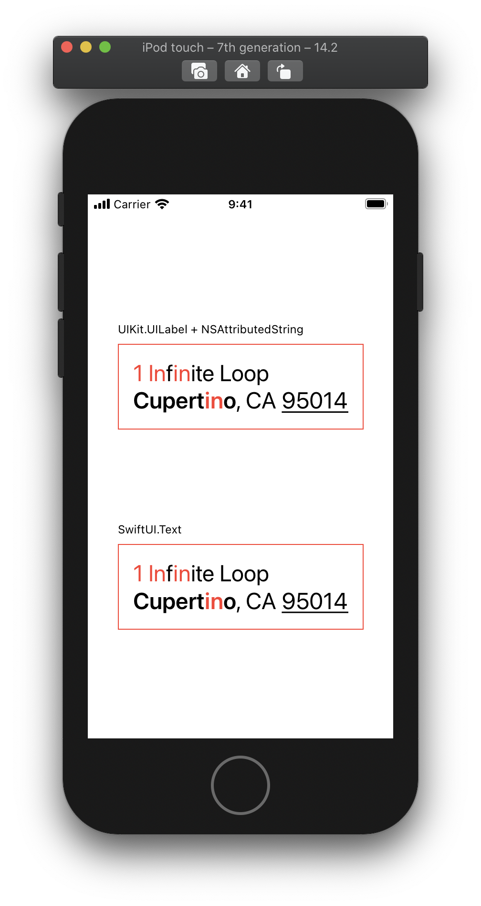

# Annotated

[](https://cocoapods.org/pods/Annotated)
[](https://cocoapods.org/pods/Annotated)
[](https://cocoapods.org/pods/Annotated)

*Annotated* is a small library that let you annotate your strings with semantic annotations.
Once a `String` is annotated, you can transform it to a `NSAttributedString` or a SwiftUI `Text`

It allows you, for example, to semantically annotate a `String` in your _View Model_ without thinking about the final visual style, and then render your `String` in your _View_ as an `NSAttributedString`.

## Requirements

- iOS 11.0
- Swift 5.1

## Installation
*Annotated* is available through CocoaPods and SwiftPM

## Example

First, you need to define your annotations. Using an `enum` is generally great for that.
```swift
enum AddressAnnotations: Hashable {
    case city, postalCode, highlighted
}
```

Then you can create you `Annotated<AddressAnnotations>` string using a string literal. You can directly annotate parts of your string thanks to custom String Interpolation.
```swift
var string: Annotated<AddressAnnotations> = """
1 Infinite Loop
\("Cupertino", .city), CA \(95014, .postalCode)
"""
```

You can also add annotations manually.
```swift
string.addAnnotation(.highlighted, at: 0..<1)
string.addAnnotation(.highlighted, forOccurencesOf: "in", options: .caseInsensitive)
```

Finally, you can render your string into an `NSAttributedString` or a SwiftUI `Text` using provided factory methods.

```swift 
let attributedString = string.makeAttributedString { annotation in
  switch annotation {
  case nil:          return [.font: UIFont.systemFont(ofSize: 24)]
  case .city:        return [.font: UIFont.boldSystemFont(ofSize: 24)]
  case .postalCode:  return [.underlineStyle: NSNumber(value: NSUnderlineStyle.single.rawValue)]
  case .highlighted: return [.foregroundColor: UIColor.systemRed]
  }
}
```
```swift
let text = string.makeText { annotation in
  switch annotation {
  case nil:          return { $0.font(.system(size: 24)) }
  case .city:        return { $0.bold() }
  case .postalCode:  return { $0.underline() }
  case .highlighted: return { $0.foregroundColor(.red) }
  }
}
```



## Author

[Jérôme Alves](https://twitter.com/jegnux)

## License

**Annotated** is available under the MIT license. See the [LICENSE](LICENSE) file for more info.
